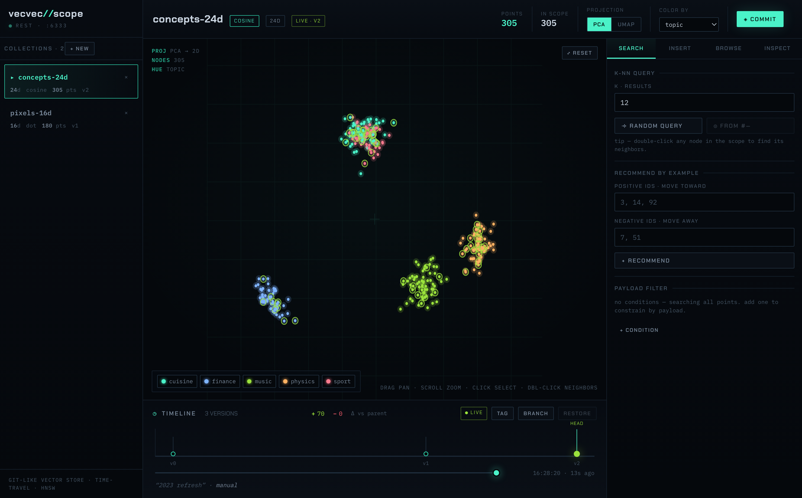

# vecvec // SCOPE

An instrument panel for exploring a [vecvec](../README.md) vector database — a dark,
blueprint-grid UI that turns a git-like vector store into something you can *see*.



## What it does

- **2D projection scope** — every point in a collection projected to 2D with **PCA**
  (instant, deterministic) or **UMAP** (tighter clusters), rendered as a pan/zoom
  oscilloscope. Color points by any payload field, hover for details, click to select,
  double-click to find a node's nearest neighbors (drawn as phosphor hairlines).
- **Timeline scrubbing** — vecvec is versioned (git-like). The timeline lays out every
  commit by wall-clock time; scrub it to **time-travel** — the scope and table re-render
  *as of* that version (snapshot isolation: deletes after a commit never change what the
  commit sees). Per-version diff readout (`+added / −removed`), plus tag / branch / restore.
- **CRUD** — create & drop collections, insert points (single, or a clustered random
  batch to populate a fresh scope), browse them in a table, inspect a point's full vector
  + payload, and delete points. All writes are durable (WAL-first) and appear live.
- **Search** — k-NN query (random vector, or from a selected point), recommend-by-example
  (positive / negative ids), and a payload filter builder (`must` conditions with
  `= > ≥ < ≤`). Results highlight in the scope.

## Run it

You need the vecvec server (Rust) running, then the UI (Vite/React).

```bash
# 1. start the vecvec server (from the repo root) — REST on :6333, gRPC on :6334
cargo run -p vecvec-server

# 2. install + run the UI (from this folder)
cd vvui
npm install
npm run dev            # → http://localhost:5273

# 3. (optional) load demo data: two collections, several committed versions
npm run seed
```

Open **http://localhost:5273**. If the server isn't up yet, the UI shows a "no signal"
screen with a retry button.

### Configuration

- The dev server proxies `/api/*` → `http://127.0.0.1:6333` (the vecvec REST gateway), so
  the browser talks same-origin in dev. Point it elsewhere with
  `VECVEC_REST_URL=http://host:port npm run dev`.
- The seed script honors `VECVEC_REST_URL` too (defaults to `http://127.0.0.1:6333`).

## How it talks to vecvec

The UI is a pure client of the vecvec **REST** gateway. Building it surfaced that the
gateway didn't expose everything an explorer needs (listing collections, reading a point's
*vector* — search only returns `{id, score}` — deleting points, diffs, tags/branches), so
this branch extends `vecvec-server` to mirror more of the engine's existing capabilities.
Endpoints used:

| Method | Path | Purpose |
| --- | --- | --- |
| `GET` | `/collections` | list collections + stats |
| `POST` `DELETE` `GET` | `/collections/{name}` | create / drop / stats |
| `POST` | `/collections/{name}/points` | upsert points |
| `GET` | `/collections/{name}/points?offset=&limit=&version=` | **scroll** points (id + vector + payload), optionally at a version |
| `GET` `DELETE` | `/collections/{name}/points/{id}` | get / delete a point |
| `POST` | `/collections/{name}/query` · `/recommend` | k-NN · recommend-by-example |
| `POST` | `/collections/{name}/commit` | snapshot a version |
| `GET` | `/collections/{name}/versions` | version DAG |
| `GET` | `/collections/{name}/diff?from=&to=` | added / removed ids |
| `POST` | `/collections/{name}/tags` · `/branches` · `/restore` | versioning ops |

A permissive CORS layer was added to the gateway so the UI also works without the dev
proxy.

## Stack

React 18 · TypeScript · Vite · Zustand · Canvas 2D · [umap-js]. No UI framework — the
"dark terminal / blueprint" look is hand-built CSS (Chakra Petch + IBM Plex Mono). The PCA
projection is implemented from scratch (`src/lib/pca.ts`) via power iteration, so it
handles high-dimensional vectors without materializing a covariance matrix.

[umap-js]: https://github.com/PAIR-code/umap-js
